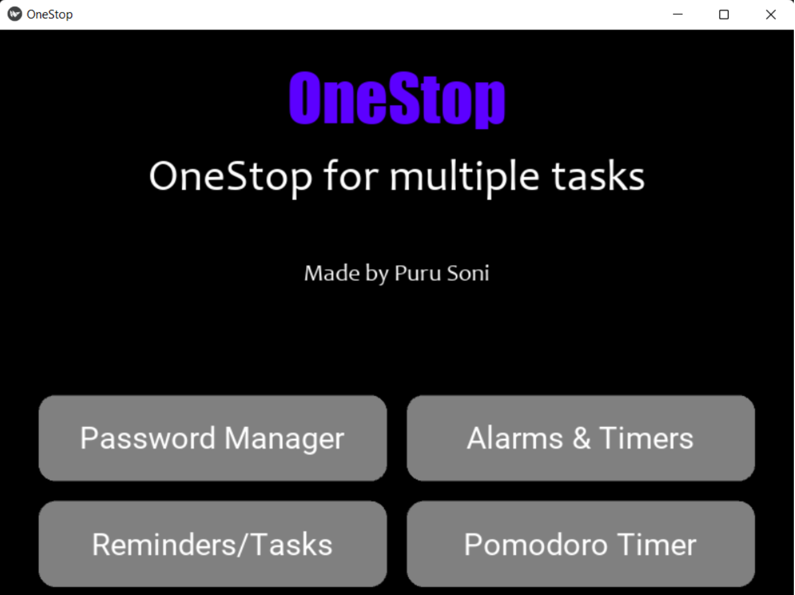
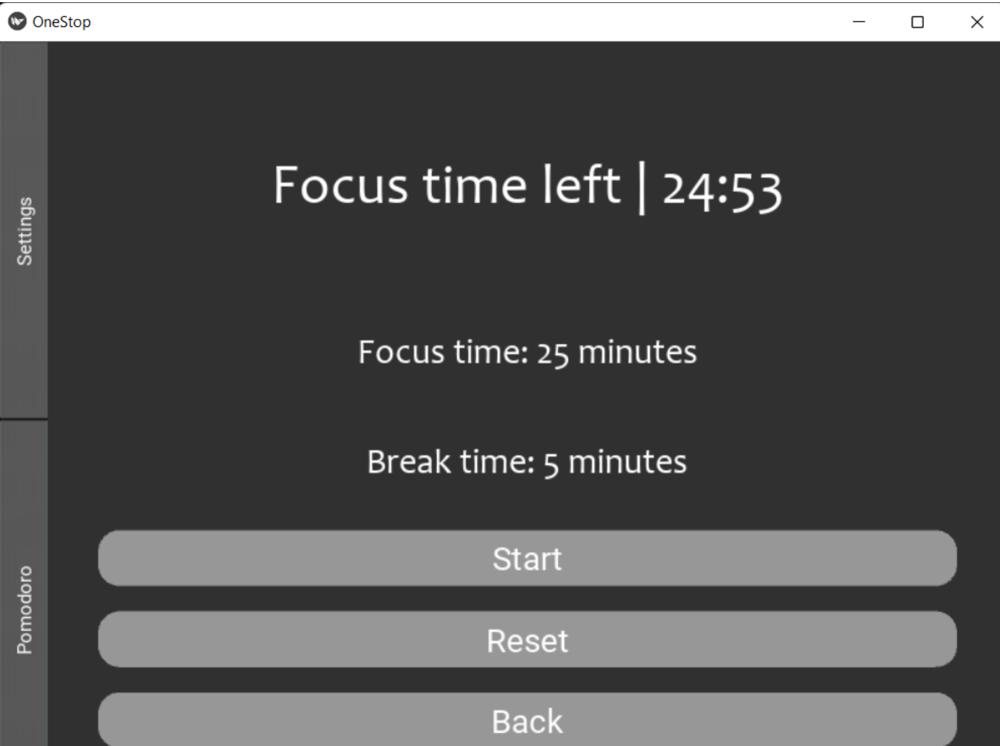
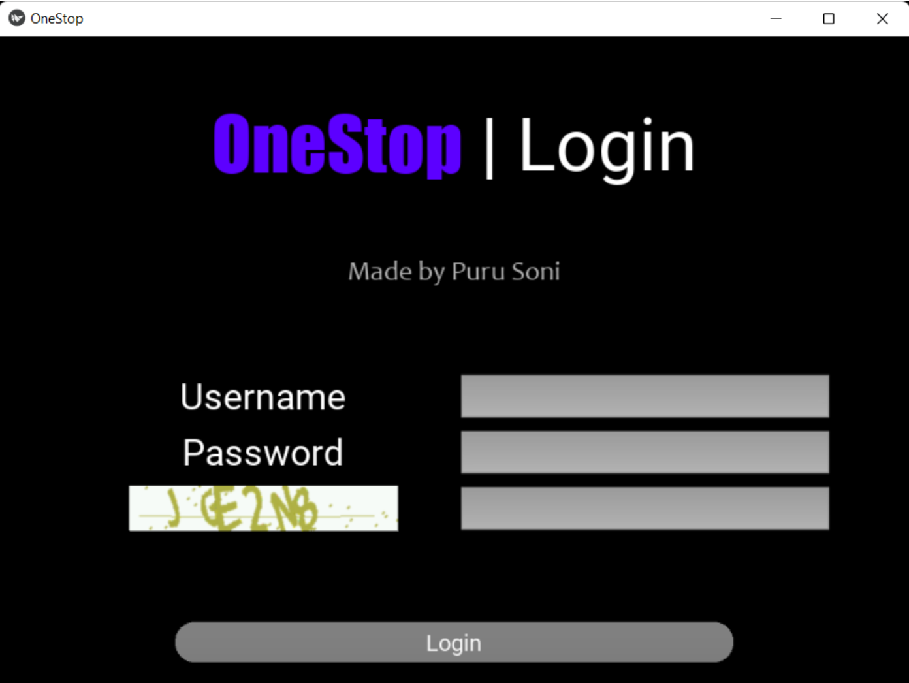
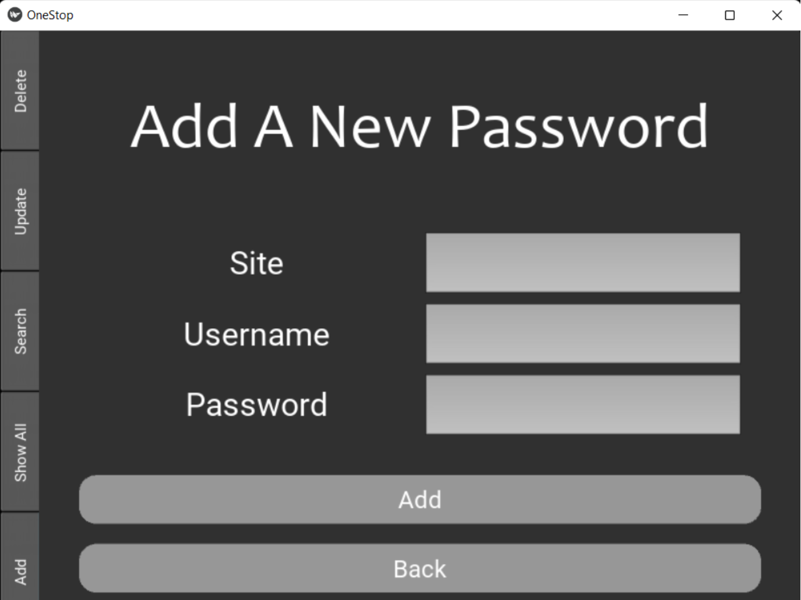
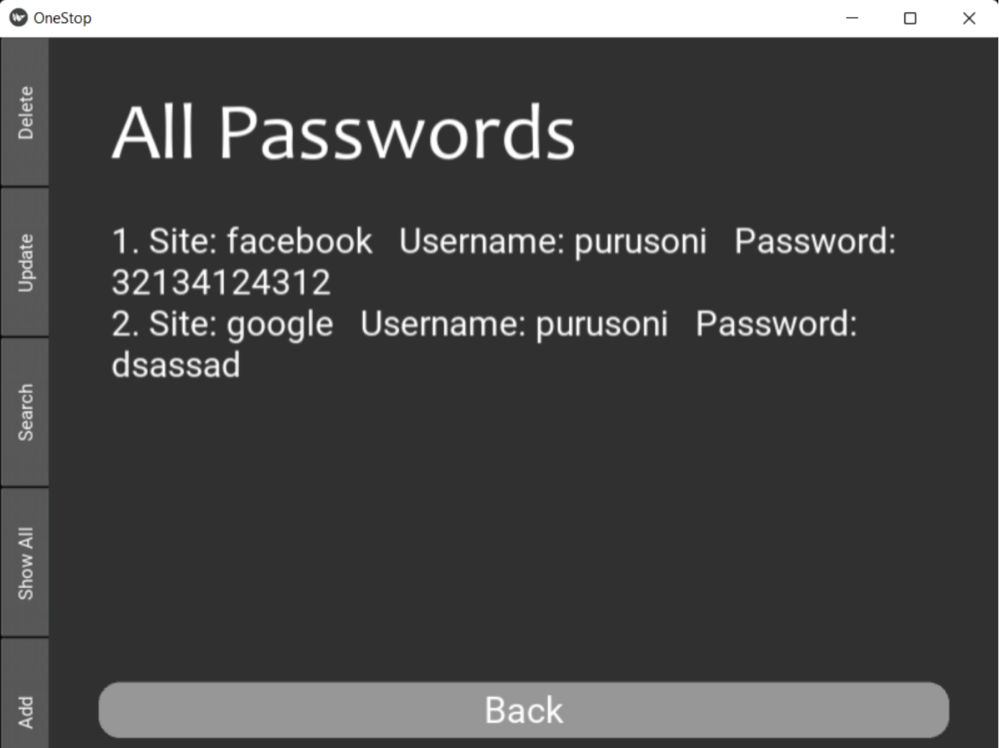
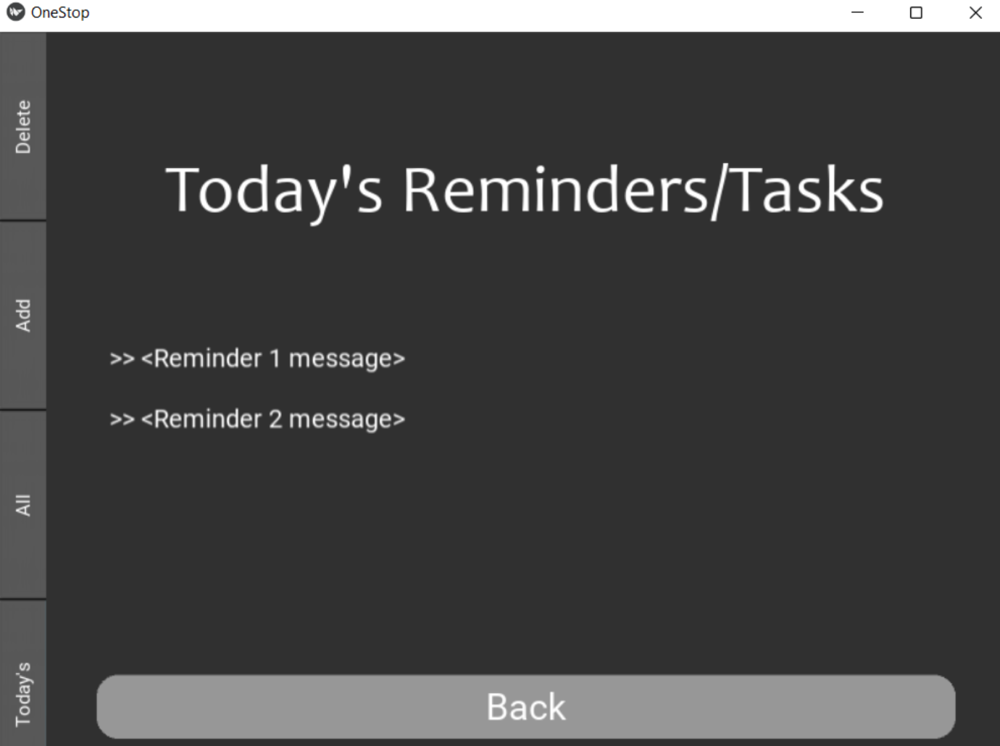
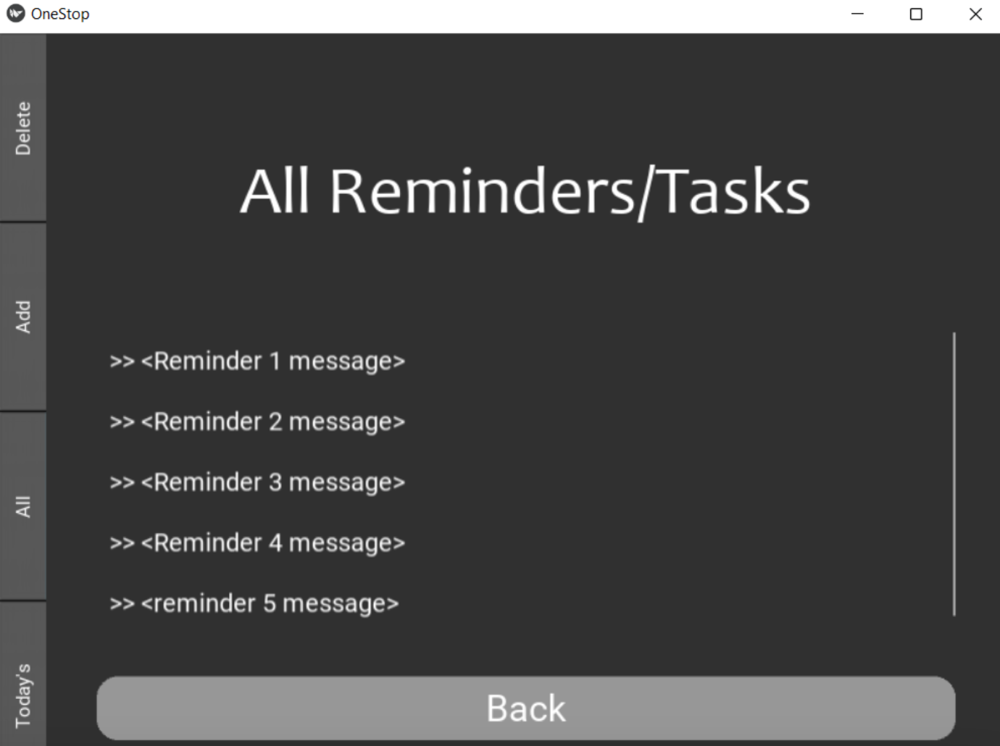
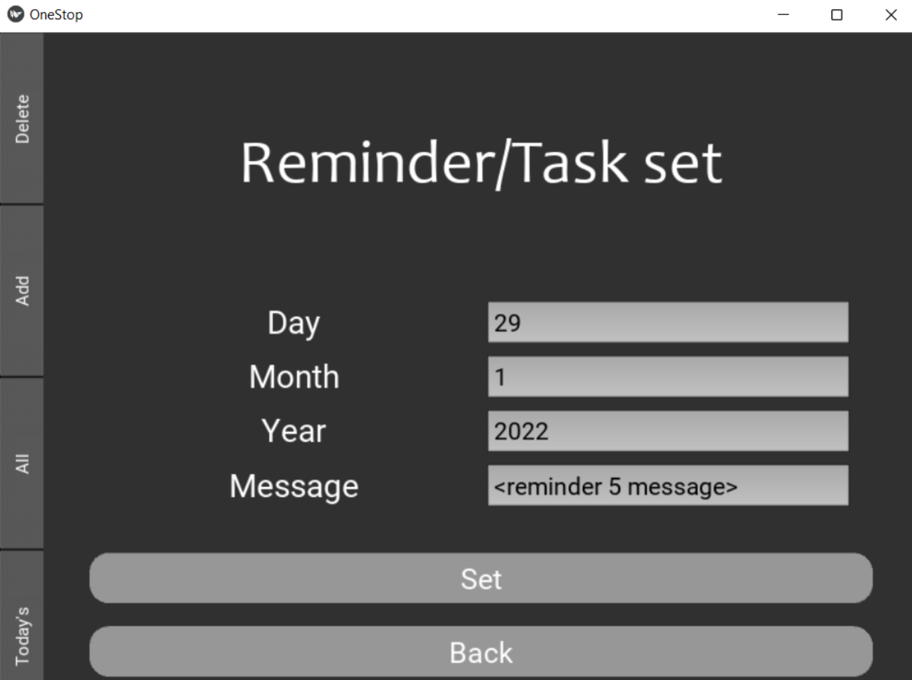

# OneStop - Personal Management App
OneStop is an all-in-one personal management application, made using the Kivy library, that consolidates multiple functionalities into one easy-to-use interface. Instead of juggling multiple applications for various personal management tasks, OneStop offers a unified solution.



<br>



## Features

1. **Password Management:** Securely store, retrieve, update, and delete passwords using MySQL.
2. **Alarms and Timers:** Set alarms and timers with or without display messages. Alarms trigger default Windows notifications paired with beep sounds.
3. **Tasks and Date-based Reminders:** Manage tasks based on dates. Options include viewing:
   - Today's tasks
   - All tasks
4. **Pomodoro Timer:** Utilize the Pomodoro Technique with customizable focus and break durations.

## Prerequisites

- **Windows:** Windows 8 or higher recommended.
- **MySQL Installation:** MySQL Community Server 8.0 or higher recommended.

## Installation

1. Clone this repository.
2. Navigate to the project directory.
3. Install the required packages:
    
    ```bash
    pip install -r requirements.txt
    ```


## Getting Started

Before running the app:
- Open the `.py` source code file and modify the `mysql_<credential-titles>` with your local MySQL credentials (Lines 17-20).

To run the app:
- Open the terminal and navigate to the project directory. Run the following command:

    ```bash
    python onestop.py
    ```


Upon launching the app, you'll encounter the login window:



<br>

**Default Login Credentials:**
  - **Username:** user123
  - **Password:** password123

## Screenshots (more available in the screenshots folder)





